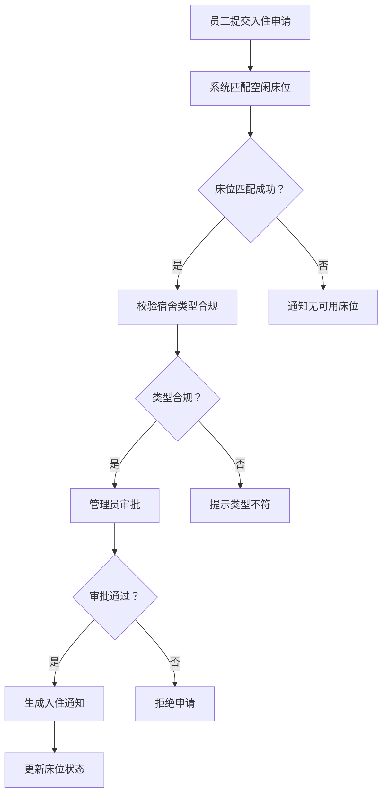
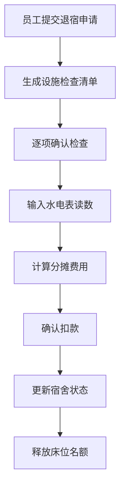
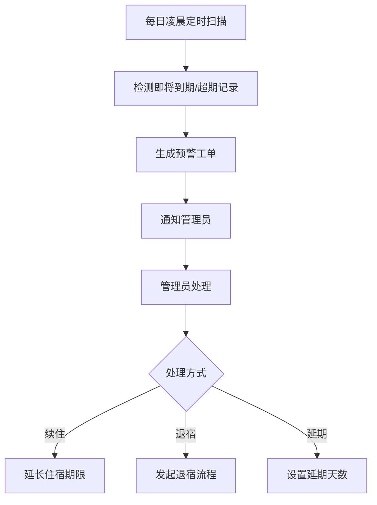

## 1. 产品概述

企业宿舍智能管理系统——为中小企业提供宿舍入住、退宿、预警、报表全流程数字化管理平台。系统根据性别与部门规则自动匹配空闲床位，校验宿舍类型合规性，支持批量导入宿舍数据、到期自动预警、月度统计报表及全操作日志审计。

- 目标用户：企业行政/后勤管理员、住宿员工
- 核心价值：减少人工分配差错、提升退宿结算效率、预警超期住宿风险、数据驱动宿舍资源优化

## 2. 核心功能

### 2.1 用户角色

| 角色 | 注册方式 | 核心权限 |
|------|----------|----------|
| 管理员 | 系统预设账号 | 审批入住/退宿、管理宿舍资源、批量导入、查看报表与预警、查询日志 |
| 员工 | 系统预设账号 | 提交入住申请、查看入住通知、提交退宿申请、确认检查清单、查看个人住宿信息 |

### 2.2 功能模块

1. **仪表盘**：入住率概览、预警提醒、待办事项、最近操作动态
2. **入住管理**：入住申请列表、智能床位匹配、入住通知生成
3. **退宿管理**：退宿申请处理、设施检查清单、水电费分摊计算
4. **宿舍管理**：宿舍楼/房间/床位管理、批量导入校验
5. **预警中心**：到期/超期住宿预警、工单管理
6. **统计报表**：月度入住率、平均水电费、退宿完成时长、趋势图表、PDF/Excel导出
7. **操作日志**：全操作日志记录、组合查询、批量导出

### 2.3 页面详情

| 页面名称 | 模块名称 | 功能描述 |
|----------|----------|----------|
| 仪表盘 | 入住率卡片 | 展示总床位、已入住、空闲数、入住率百分比 |
| 仪表盘 | 预警提醒 | 显示即将到期/超期住宿条目数，可跳转预警中心 |
| 仪表盘 | 待办事项 | 待审批入住申请、待处理退宿申请数量 |
| 仪表盘 | 最近动态 | 最近10条入住/退宿/检查操作记录 |
| 入住管理 | 申请列表 | 员工入住申请表格，支持筛选状态（待审批/已分配/已拒绝） |
| 入住管理 | 审批与分配 | 查看申请详情，系统推荐匹配床位，管理员确认分配 |
| 入住管理 | 入住通知 | 分配成功后自动生成电子入住通知，可预览/打印 |
| 退宿管理 | 退宿列表 | 退宿申请表格，支持筛选状态（待检查/待确认/待结算/已完成） |
| 退宿管理 | 设施检查 | 生成检查清单（家具、电器、墙面等），逐项勾选 |
| 退宿管理 | 费用结算 | 输入水电表读数，自动计算分摊费用，确认扣款 |
| 宿舍管理 | 楼栋列表 | 宿舍楼信息卡片，展示楼栋名、楼层、房间数、入住率 |
| 宿舍管理 | 房间详情 | 房间内床位列表、入住人信息、宿舍类型（单人间/双人间/四人间） |
| 宿舍管理 | 批量导入 | 上传Excel/CSV文件，自动校验楼层编号和容量，提示错误行 |
| 预警中心 | 预警列表 | 到期/超期住宿记录，支持筛选预警级别（即将到期/已超期） |
| 预警中心 | 工单处理 | 生成预警工单，管理员标记处理状态 |
| 统计报表 | 入住率趋势 | 折线图展示月度入住率变化 |
| 统计报表 | 水电费统计 | 柱状图展示各宿舍楼平均水电费 |
| 统计报表 | 退宿时长 | 表格展示退宿完成平均时长 |
| 统计报表 | 导出功能 | 支持导出PDF和Excel报告 |
| 操作日志 | 日志列表 | 按时间倒序展示所有操作记录 |
| 操作日志 | 组合查询 | 按员工姓名、房间编号、时间段组合筛选 |
| 操作日志 | 批量导出 | 筛选结果支持导出Excel |

## 3. 核心流程

### 入住流程
员工提交入住申请 → 系统根据性别+部门规则匹配空闲床位 → 校验宿舍类型合规性（如：部门经理可申请单人间）→ 管理员审批确认 → 系统生成电子入住通知 → 更新床位状态

### 退宿流程
员工提交退宿申请 → 系统生成设施检查清单 → 员工/管理员逐项确认 → 输入水电表读数 → 系统计算分摊费用 → 确认扣款 → 更新宿舍状态、释放床位名额

### 预警流程
每日凌晨定时扫描 → 检测即将到期（7天内）和超期未续住记录 → 生成预警工单 → 通知管理员 → 管理员处理（续住/退宿/延期）

## 4. 用户界面设计

### 4.1 设计风格

- 主色调：深靛蓝 (#1E3A5F) — 专业、稳重、企业级
- 辅助色：翡翠绿 (#10B981) — 用于成功/正常状态，暖琥珀 (#F59E0B) — 用于预警/待处理
- 强调色：珊瑚红 (#EF4444) — 用于超期/错误状态
- 按钮风格：圆角（8px）、轻微阴影、hover渐变过渡
- 字体：Noto Sans SC（中文主体）、DM Sans（英文/数字）
- 布局风格：左侧固定导航栏 + 顶部面包屑 + 右侧内容区卡片式布局
- 图标风格：线性图标（Lucide），2px描边

### 4.2 页面设计概览

| 页面名称 | 模块名称 | UI元素 |
|----------|----------|--------|
| 仪表盘 | 入住率卡片 | 渐变背景卡片、大号数字、进度环 |
| 仪表盘 | 预警提醒 | 黄色/红色边框卡片、图标+计数、跳转链接 |
| 仪表盘 | 待办事项 | 列表卡片、状态标签、快捷操作按钮 |
| 仪表盘 | 最近动态 | 时间线布局、操作类型图标、描述文字 |
| 入住管理 | 申请列表 | 表格、状态徽章、筛选下拉、搜索框 |
| 入住管理 | 审批与分配 | 侧滑面板、床位推荐卡片、确认/拒绝按钮 |
| 入住管理 | 入住通知 | 模拟纸质通知单、打印按钮、PDF下载 |
| 退宿管理 | 退宿列表 | 表格、步骤进度条、状态标签 |
| 退宿管理 | 设施检查 | 检查清单勾选、备注输入、照片上传区 |
| 退宿管理 | 费用结算 | 水电读数输入、自动计算展示、分摊明细表 |
| 宿舍管理 | 楼栋列表 | 卡片网格、楼栋图示、入住率进度条 |
| 宿舍管理 | 房间详情 | 床位网格图、入住人头像标签 |
| 宿舍管理 | 批量导入 | 拖拽上传区、校验结果表格、错误行高亮 |
| 预警中心 | 预警列表 | 表格、级别标签（黄/红）、天数倒计时 |
| 预警中心 | 工单处理 | 工单详情面板、处理操作按钮 |
| 统计报表 | 图表区 | 折线图/柱状图（Recharts）、月份选择器 |
| 统计报表 | 导出功能 | 导出按钮组（PDF/Excel） |
| 操作日志 | 日志列表 | 表格、操作类型图标、时间戳 |
| 操作日志 | 组合查询 | 多条件筛选面板、日期范围选择器 |
| 操作日志 | 批量导出 | 导出按钮 |

### 4.3 响应式设计

- 桌面优先设计，最小宽度1200px完整体验
- 平板端（768-1200px）：侧边栏折叠为图标模式，卡片改为双列
- 移动端（<768px）：底部导航栏，卡片单列，表格改为卡片列表

### 4.4 3D场景指引

不适用
