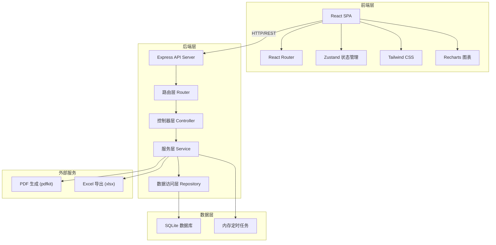
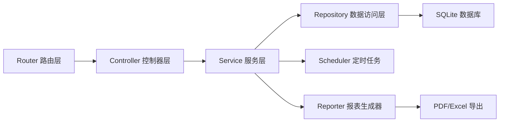
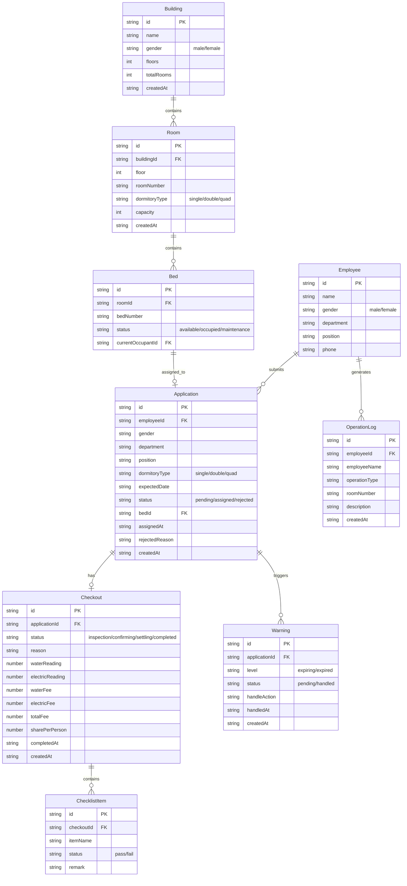

## 1. 架构设计



## 2. 技术说明

- 前端：React@18 + TypeScript + Tailwind CSS@3 + Vite
- 初始化工具：vite-init
- 后端：Express@4 + TypeScript（ESM格式）
- 数据库：SQLite（better-sqlite3），无需额外安装数据库服务
- 图表：Recharts（折线图、柱状图、饼图）
- PDF生成：jspdf
- Excel导出：xlsx（SheetJS）
- 状态管理：Zustand
- 路由：react-router-dom v6
- 图标：lucide-react

## 3. 路由定义

| 路由 | 用途 |
|------|------|
| / | 仪表盘，展示入住率、预警、待办、动态 |
| /checkin | 入住管理，申请列表 |
| /checkin/:id | 入住申请详情，审批与分配 |
| /checkin/notice/:id | 入住通知预览 |
| /checkout | 退宿管理，退宿列表 |
| /checkout/:id | 退宿详情，检查与结算 |
| /dormitory | 宿舍管理，楼栋列表 |
| /dormitory/:buildingId | 楼栋房间详情 |
| /dormitory/import | 批量导入 |
| /warning | 预警中心，预警列表 |
| /report | 统计报表，图表与导出 |
| /log | 操作日志，查询与导出 |

## 4. API定义

### 4.1 入住管理

```typescript
// GET /api/applications - 获取入住申请列表
interface ApplicationListQuery {
  status?: "pending" | "assigned" | "rejected";
  keyword?: string;
  page?: number;
  pageSize?: number;
}
interface ApplicationListResponse {
  total: number;
  list: Application[];
}

// POST /api/applications - 提交入住申请
interface CreateApplicationBody {
  employeeId: string;
  employeeName: string;
  gender: "male" | "female";
  department: string;
  position: string;
  dormitoryType: "single" | "double" | "quad";
  expectedDate: string;
}

// PUT /api/applications/:id/approve - 审批通过并分配床位
interface ApproveApplicationBody {
  bedId: string;
}

// PUT /api/applications/:id/reject - 拒绝申请
interface RejectApplicationBody {
  reason: string;
}

// GET /api/applications/:id/match-beds - 获取匹配的空闲床位推荐
interface MatchBedsResponse {
  beds: Bed[];
}
```

### 4.2 退宿管理

```typescript
// GET /api/checkouts - 获取退宿列表
interface CheckoutListQuery {
  status?: "inspection" | "confirming" | "settling" | "completed";
  keyword?: string;
  page?: number;
  pageSize?: number;
}

// POST /api/checkouts - 提交退宿申请
interface CreateCheckoutBody {
  applicationId: string;
  reason: string;
}

// GET /api/checkouts/:id/checklist - 获取设施检查清单
interface ChecklistResponse {
  items: ChecklistItem[];
}

// PUT /api/checkouts/:id/checklist - 提交检查结果
interface UpdateChecklistBody {
  items: { itemId: string; status: "pass" | "fail"; remark?: string }[];
}

// PUT /api/checkouts/:id/settle - 费用结算
interface SettleCheckoutBody {
  waterReading: number;
  electricReading: number;
}
interface SettleCheckoutResponse {
  waterFee: number;
  electricFee: number;
  totalFee: number;
  sharePerPerson: number;
}
```

### 4.3 宿舍管理

```typescript
// GET /api/buildings - 获取楼栋列表
interface BuildingListResponse {
  buildings: Building[];
}

// GET /api/buildings/:id/rooms - 获取楼栋房间列表
interface RoomListResponse {
  rooms: Room[];
}

// POST /api/buildings/import - 批量导入宿舍数据
interface ImportBody {
  data: BuildingImportRow[];
}
interface ImportResponse {
  success: number;
  failed: number;
  errors: { row: number; message: string }[];
}

// GET /api/beds/available - 获取可用床位
interface AvailableBedsQuery {
  gender?: "male" | "female";
  dormitoryType?: "single" | "double" | "quad";
  buildingId?: string;
}
```

### 4.4 预警管理

```typescript
// GET /api/warnings - 获取预警列表
interface WarningListQuery {
  level?: "expiring" | "expired";
  handled?: boolean;
  page?: number;
  pageSize?: number;
}

// PUT /api/warnings/:id/handle - 处理预警
interface HandleWarningBody {
  action: "renew" | "checkout" | "extend";
  extendDays?: number;
}
```

### 4.5 统计报表

```typescript
// GET /api/reports/monthly - 月度统计
interface MonthlyReportQuery {
  month: string; // YYYY-MM
}
interface MonthlyReportResponse {
  occupancyRate: { month: string; rate: number }[];
  utilityCost: { building: string; avgCost: number }[];
  checkoutDuration: { month: string; avgDays: number }[];
}

// GET /api/reports/export/pdf - 导出PDF
// GET /api/reports/export/excel - 导出Excel
```

### 4.6 操作日志

```typescript
// GET /api/logs - 获取操作日志
interface LogListQuery {
  employeeName?: string;
  roomNumber?: string;
  startDate?: string;
  endDate?: string;
  operationType?: "checkin" | "checkout" | "inspection" | "import" | "warning";
  page?: number;
  pageSize?: number;
}

// GET /api/logs/export - 批量导出日志
```

### 4.7 仪表盘

```typescript
// GET /api/dashboard - 获取仪表盘数据
interface DashboardResponse {
  totalBeds: number;
  occupiedBeds: number;
  availableBeds: number;
  occupancyRate: number;
  pendingApplications: number;
  pendingCheckouts: number;
  expiringCount: number;
  expiredCount: number;
  recentActivities: Activity[];
}
```

## 5. 服务端架构图



## 6. 数据模型

### 6.1 数据模型定义



### 6.2 数据定义语言

```sql
CREATE TABLE buildings (
  id TEXT PRIMARY KEY,
  name TEXT NOT NULL,
  gender TEXT NOT NULL CHECK(gender IN ('male', 'female')),
  floors INTEGER NOT NULL,
  total_rooms INTEGER NOT NULL DEFAULT 0,
  created_at TEXT NOT NULL DEFAULT (datetime('now'))
);

CREATE TABLE rooms (
  id TEXT PRIMARY KEY,
  building_id TEXT NOT NULL REFERENCES buildings(id),
  floor INTEGER NOT NULL,
  room_number TEXT NOT NULL,
  dormitory_type TEXT NOT NULL CHECK(dormitory_type IN ('single', 'double', 'quad')),
  capacity INTEGER NOT NULL,
  created_at TEXT NOT NULL DEFAULT (datetime('now'))
);

CREATE TABLE beds (
  id TEXT PRIMARY KEY,
  room_id TEXT NOT NULL REFERENCES rooms(id),
  bed_number TEXT NOT NULL,
  status TEXT NOT NULL DEFAULT 'available' CHECK(status IN ('available', 'occupied', 'maintenance')),
  current_occupant_id TEXT,
  created_at TEXT NOT NULL DEFAULT (datetime('now'))
);

CREATE TABLE employees (
  id TEXT PRIMARY KEY,
  name TEXT NOT NULL,
  gender TEXT NOT NULL CHECK(gender IN ('male', 'female')),
  department TEXT NOT NULL,
  position TEXT NOT NULL,
  phone TEXT,
  created_at TEXT NOT NULL DEFAULT (datetime('now'))
);

CREATE TABLE applications (
  id TEXT PRIMARY KEY,
  employee_id TEXT NOT NULL REFERENCES employees(id),
  gender TEXT NOT NULL,
  department TEXT NOT NULL,
  position TEXT NOT NULL,
  dormitory_type TEXT NOT NULL CHECK(dormitory_type IN ('single', 'double', 'quad')),
  expected_date TEXT NOT NULL,
  status TEXT NOT NULL DEFAULT 'pending' CHECK(status IN ('pending', 'assigned', 'rejected')),
  bed_id TEXT REFERENCES beds(id),
  assigned_at TEXT,
  rejected_reason TEXT,
  start_date TEXT,
  end_date TEXT,
  created_at TEXT NOT NULL DEFAULT (datetime('now'))
);

CREATE TABLE checkouts (
  id TEXT PRIMARY KEY,
  application_id TEXT NOT NULL REFERENCES applications(id),
  status TEXT NOT NULL DEFAULT 'inspection' CHECK(status IN ('inspection', 'confirming', 'settling', 'completed')),
  reason TEXT,
  water_reading REAL DEFAULT 0,
  electric_reading REAL DEFAULT 0,
  water_fee REAL DEFAULT 0,
  electric_fee REAL DEFAULT 0,
  total_fee REAL DEFAULT 0,
  share_per_person REAL DEFAULT 0,
  completed_at TEXT,
  created_at TEXT NOT NULL DEFAULT (datetime('now'))
);

CREATE TABLE checklist_items (
  id TEXT PRIMARY KEY,
  checkout_id TEXT NOT NULL REFERENCES checkouts(id),
  item_name TEXT NOT NULL,
  status TEXT NOT NULL DEFAULT 'pending' CHECK(status IN ('pending', 'pass', 'fail')),
  remark TEXT
);

CREATE TABLE warnings (
  id TEXT PRIMARY KEY,
  application_id TEXT NOT NULL REFERENCES applications(id),
  level TEXT NOT NULL CHECK(level IN ('expiring', 'expired')),
  status TEXT NOT NULL DEFAULT 'pending' CHECK(status IN ('pending', 'handled')),
  handle_action TEXT,
  handled_at TEXT,
  created_at TEXT NOT NULL DEFAULT (datetime('now'))
);

CREATE TABLE operation_logs (
  id TEXT PRIMARY KEY,
  employee_id TEXT,
  employee_name TEXT,
  operation_type TEXT NOT NULL CHECK(operation_type IN ('checkin', 'checkout', 'inspection', 'import', 'warning', 'other')),
  room_number TEXT,
  description TEXT NOT NULL,
  created_at TEXT NOT NULL DEFAULT (datetime('now'))
);

CREATE INDEX idx_rooms_building ON rooms(building_id);
CREATE INDEX idx_beds_room ON beds(room_id);
CREATE INDEX idx_beds_status ON beds(status);
CREATE INDEX idx_applications_employee ON applications(employee_id);
CREATE INDEX idx_applications_status ON applications(status);
CREATE INDEX idx_checkouts_application ON checkouts(application_id);
CREATE INDEX idx_checkouts_status ON checkouts(status);
CREATE INDEX idx_checklist_checkout ON checklist_items(checkout_id);
CREATE INDEX idx_warnings_application ON warnings(application_id);
CREATE INDEX idx_warnings_status ON warnings(status);
CREATE INDEX idx_logs_employee ON operation_logs(employee_id);
CREATE INDEX idx_logs_type ON operation_logs(operation_type);
CREATE INDEX idx_logs_created ON operation_logs(created_at);
```
